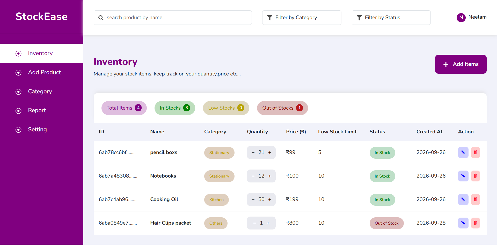
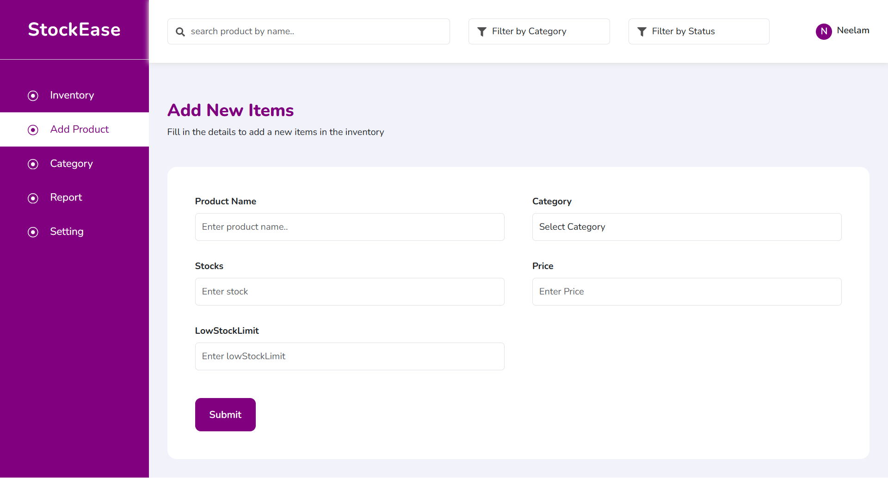
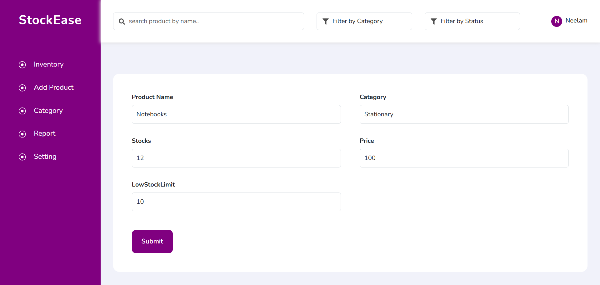

# Inventory Management System

A full-stack Inventory Management System built with **React, Redux Toolkit, Node.js, Express.js, and MongoDB**.

The application allows users to manage products, including adding, editing, deleting products and updating product quantities. It also displays stock status based on the available quantity and low-stock limit.

## Features

* View all products
* Add new products
* Edit product details
* Delete products
* Increase/decrease product quantity
* Search products
* Filter products by category
* Filter products by stock status
* Low Stock and Out of Stock status
* MongoDB database persistence

---

## Tech Stack

### Frontend

* React
* Redux Toolkit
* Axios
* Vite
* CSS

### Backend

* Node.js
* Express.js
* MongoDB
* Mongoose
* CORS
* dotenv

---

# Backend Setup

Go to the server folder:

```bash
cd server
```

Install dependencies:

```bash
npm install
```

Create a `.env` file inside the `server` folder:

```env
PORT=
MONGODB_URL=
```

Add your actual MongoDB connection URL and port number in the `.env` file.

Start the backend in development mode:

```bash
npm run dev
```

Or start normally:

```bash
npm start
```

The backend API runs through the Express server.

---

# Frontend Setup

Go to the client folder:

```bash
cd client
```

Install dependencies:

```bash
npm install
```

Start the frontend:

```bash
npm run dev
```

Vite will provide the local frontend URL in the terminal.

---

# API Routes

| Method | Endpoint                            | Description             |
| ------ | ----------------------------------- | ----------------------- |
| GET    | `/api/products/`                    | Get all products        |
| POST   | `/api/products/add`                 | Add a new product       |
| PUT    | `/api/products/update/:id`          | Update product details  |
| PATCH  | `/api/products/update/:id/quantity` | Update product quantity |
| DELETE | `/api/products/delete/:id`          | Delete a product        |

---

# Environment Variables

The backend requires the following environment variables:

```env
PORT=
MONGODB_URL=
```

The actual `.env` file is not included in the repository for security reasons.

An `.env.example` file is provided in the `server` folder to show the required environment variables.

---

# Screenshots

## Dashboard



## Add Product



## Edit Product


